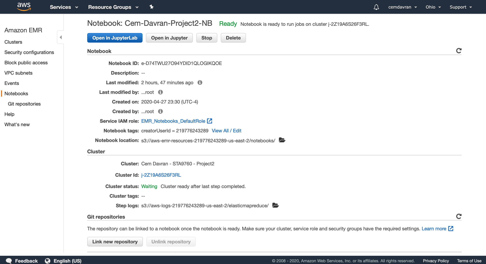

# Yelp Business Data Analysis

In this analysis I used Yelp's data (business, review and user datasets)
The data source is Kaggle which I downloaded first and uploaded back into a public s3 bucket: s3://sta9760-project2/yelp-dataset/*.json

* Project perfomed on AWS EMR. 
* I created EMR cluster on AWS and then I created PySpark notebook using this EMR cluster. 
* I used PySpark during the analysis. 

## Notebook configuration details

## Cluster configuration details

Here is the link for business dataset

* s3://sta9760-project2/yelp-dataset/yelp_academic_dataset_business.json
